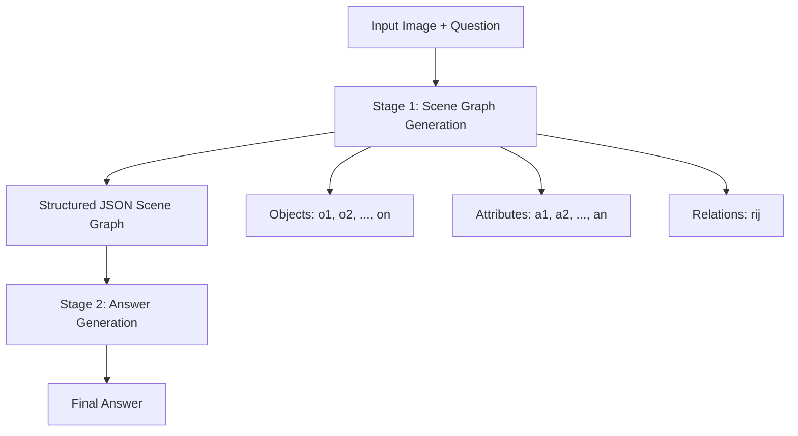

# 🧠 Scene Graph Chain-of-Thought for Spatial Reasoning

[](https://arxiv.org/abs/XXXX.XXXX)
[](https://github.com/Yvonne511/spatial-vlm-investigator)
[](https://opensource.org/licenses/MIT)

> 🎯 **Breaking the Reasoning Bottleneck**: While simple Chain-of-Thought prompting fails (and can even hurt!) spatial reasoning in Vision-Language Models, our structured Scene Graph CoT approach delivers **consistent 5-15% accuracy gains** across spatial tasks.

## ✨ Key Findings

🚫 **Simple CoT Prompting Fails**: Traditional "think first, then answer" approaches not only fail to improve spatial reasoning but can actually degrade performance in VLMs.

✅ **Scene Graph CoT Works**: Structured multi-stage prompting using scene graphs significantly improves spatial understanding and counting accuracy.

🎯 **Two-Stage is Better**: Separating scene graph generation from answer prediction prevents "reward hacking" where models shortcut reasoning.

## 🏗️ Architecture Overview

Our Scene Graph CoT framework operates in two distinct stages:



## 🚀 Quick Start

### Scene Graph Generation (Stage 1)

```python
# User Prompt
prompt_sg = """
For the provided image and its associated question, think and generate 
a scene graph in JSON format that includes:
(1) Objects relevant to answering the question
(2) Object attributes relevant to answering the question  
(3) Object relationships relevant to answering the question
"""

# System Prompt
system_sg = """
You are an AI assistant proficient in visual and spatial reasoning 
with tasks involving counting, relations, depth, distances, etc., 
and generate scene graphs based on images and questions. 
Think and then answer.
"""
```

### Answer Generation (Stage 2)

```python
# User Prompt (with scene graph from Stage 1)
prompt_answer = """
Use the image and scene graph as context and answer the following question.
"""

# System Prompt
system_answer = """
You are an AI assistant proficient in visual and spatial reasoning 
with tasks involving counting, relations, depth, distances, etc. 
Think and then answer. Final answer should be provided between 
<answer> and </answer> tags.
"""
```

## 📊 Performance Results

### CVBench Accuracy Improvements

| Model | Counting | Relation | Depth | Distance | Total |
|-------|----------|----------|-------|----------|-------|
| **Llama-4-Scout-17B** (baseline) | 54.35% | 55.08% | 74.00% | 31.33% | 53.76% |
| **+ Scene Graph CoT** | **67.64%** | **74.92%** | **89.17%** | **73.50%** | **75.66%** |
| **+ 4-shot CoT** | **68.45%** | **76.42%** | **91.02%** | **75.17%** | **77.69%** |

### Cross-Benchmark Performance

| Dataset | Baseline | + Scene Graph CoT | Improvement |
|---------|----------|-------------------|-------------|
| VSR | 68.82% | **78.14%** | +9.32% |
| CVBench | 53.76% | **75.66%** | +21.90% |
| SAT | 69.42% | **74.40%** | +4.98% |

## 🔧 Advanced Techniques

### Few-Shot Conversational CoT

Transform examples into natural user-assistant dialogues for better reasoning:

```python
# Example conversation format
conversation = [
    {"role": "user", "content": "Image: [IMAGE] Question: How many red cubes are there?"},
    {"role": "assistant", "content": "Scene Graph: {...}"},
    {"role": "user", "content": "Now provide the answer."},
    {"role": "assistant", "content": "Answer: 3"}
]
```

### Optical Flow CoT for Dynamic Scenes

For temporal spatial reasoning with image sequences:

```python
def optical_flow_cot(image1, image2, question):
    """
    Encode positional differences for egocentric and object movement
    """
    delta_positions = {
        object_i: "left" | "stationary" | "right"
        for object_i in detected_objects
    }
    return generate_scene_graph_with_motion(delta_positions)
```

## 🎛️ Configuration Options

### Basic Scene Graph CoT
```python
config = {
    "approach": "scene_graph_cot",
    "stages": 2,
    "few_shot": False,
    "conversational": False
}
```

### Advanced Few-Shot Conversational
```python
config = {
    "approach": "scene_graph_cot", 
    "stages": 2,
    "few_shot": True,
    "num_shots": 4,
    "conversational": True,
    "split_sg_answer": True  # Prevents reward hacking
}
```

## ⚠️ What Doesn't Work

Our extensive ablation studies revealed several ineffective approaches:

- ❌ **Program-of-Thought (PoT)**: Faulty code generation degrades performance
- ❌ **Visualization-of-Thought (VoT)**: Inapplicable for counting/depth tasks  
- ❌ **Chain-of-Symbols (CoS)**: Symbolic reasoning misaligns with spatial tasks
- ❌ **Depth Maps Integration**: Additional modality fusion reduces accuracy
- ❌ **Confidence Scores**: Adding uncertainty estimates introduces noise

## 📈 Why Scene Graph CoT Works

1. **Compositional Structure**: Breaking down scenes into objects, attributes, and relationships
2. **Explicit Reasoning Path**: Forces models to consider spatial relationships before answering
3. **Reward Hacking Prevention**: Two-stage design prevents shortcut reasoning
4. **Flexible Representation**: JSON format adaptable across different spatial tasks

## 🔮 Future Directions

- 🎥 **Video Spatial Reasoning**: Extending to temporal dynamics with VideoChat-R1
- 🏗️ **3D Spatial Integration**: Incorporating depth maps and scene reconstructions  
- 🤖 **Embodied Decision Making**: Applications in robotics and navigation
- 🧠 **Attention-Guided CoT**: Integrating visual attention mechanisms

## 📝 Citation

```bibtex
@article{ji2024enhancing,
  title={Enhancing Spatial Reasoning in Vision-Language Models via Chain-of-Thought Prompting and Reinforcement Learning},
  author={Ji, Binbin and Agrawal, Siddharth and Tang, Qiance and Wu, Yvonne},
  journal={arXiv preprint arXiv:XXXX.XXXX},
  year={2024}
}
```

## 🤝 Contributing

We welcome contributions! Check out our [contribution guidelines](CONTRIBUTING.md) and feel free to:

- 🐛 Report bugs or issues
- 💡 Suggest new CoT strategies  
- 📊 Add new benchmark evaluations
- 🔧 Improve existing implementations

## 📄 License

This project is licensed under the MIT License - see the [LICENSE](LICENSE) file for details.

---

<div align="center">
  <strong>🌟 Star us on GitHub if this helps your research! 🌟</strong>
</div>
